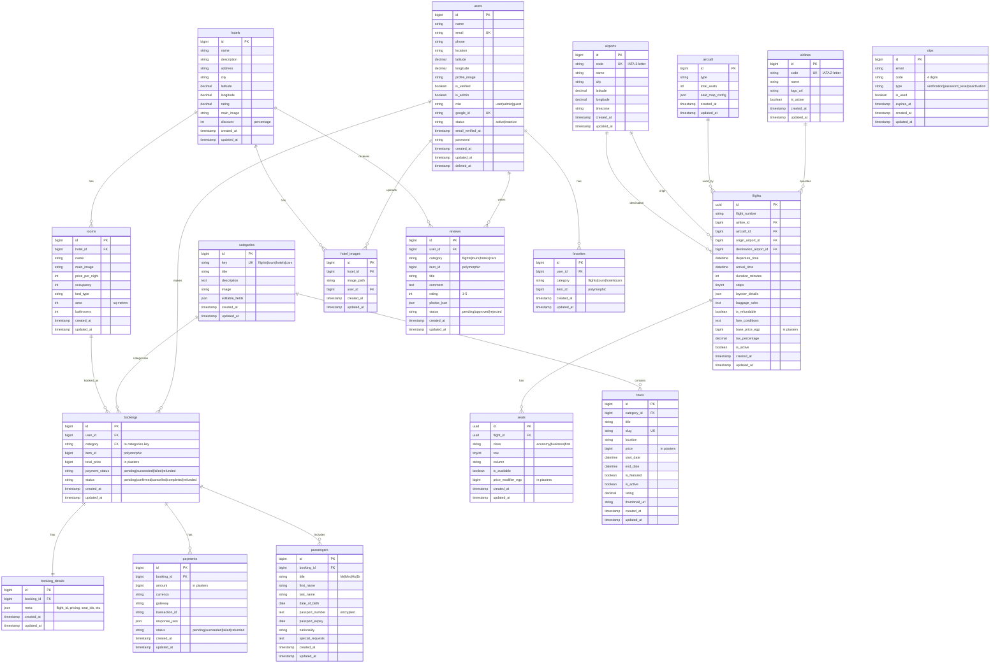
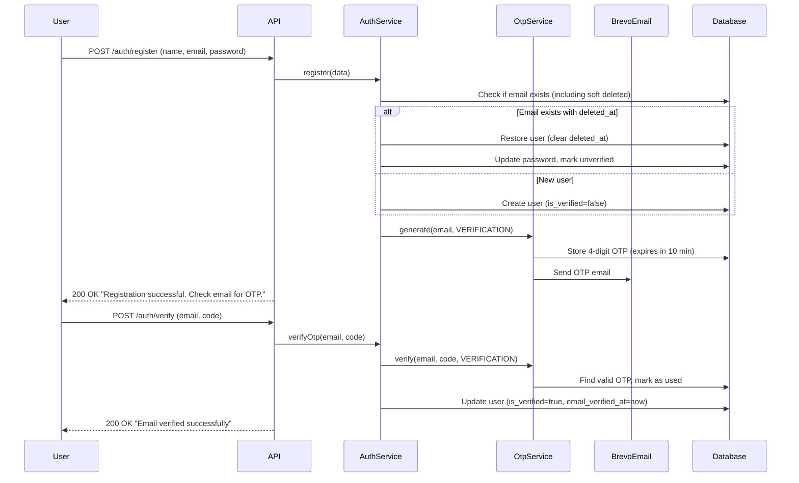
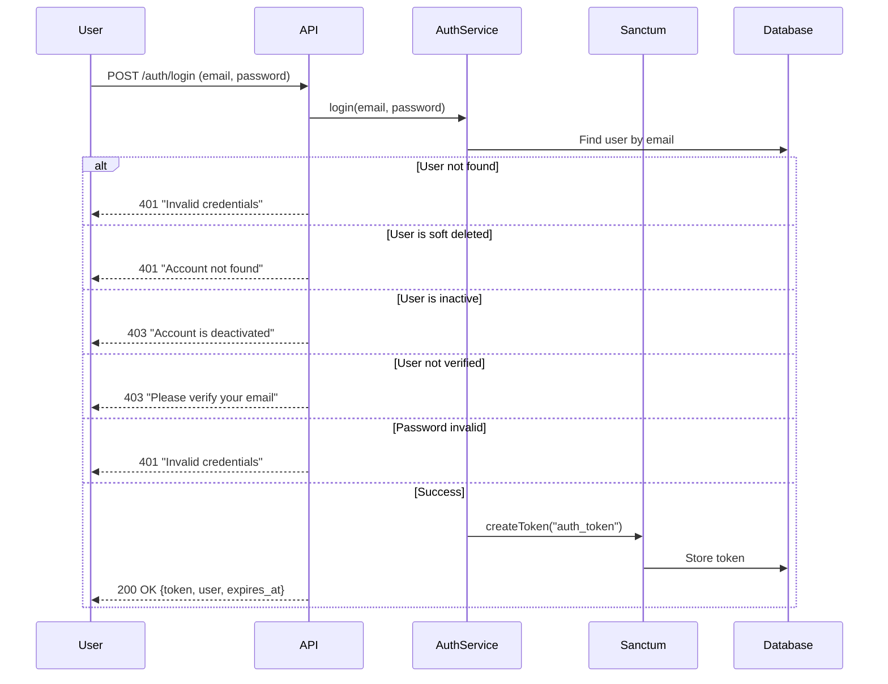
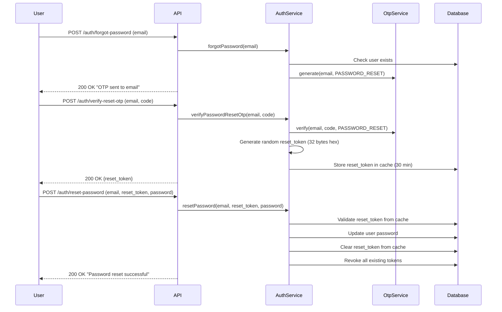
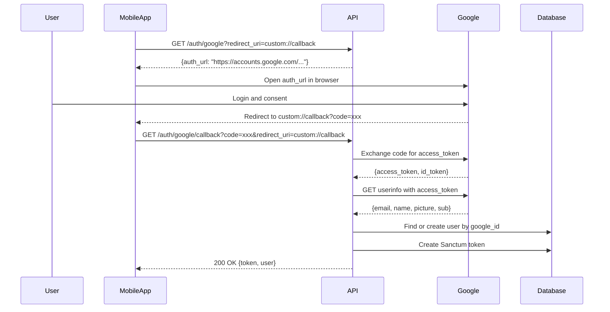

<p align="center">
  
  
  
  
</p>

<h1 align="center">🌍 Safarni - Travel Platform Backend</h1>

<p align="center">
  <strong>A comprehensive travel booking platform API built with Laravel 12</strong>
</p>

<p align="center">
  Safarni (سافرني - "Let me travel" in Arabic) is a modern travel platform backend that provides APIs for booking flights, tours, hotels, and car rentals. The platform serves as the backbone for mobile and web applications, offering secure authentication, real-time seat management, and comprehensive booking workflows.
</p>

---

## 📋 Table of Contents

- [Project Overview](#-project-overview)
- [Technology Stack](#-technology-stack)
- [Architecture](#-architecture)
- [Features Implementation Status](#-features-implementation-status)
- [Database Schema](#-database-schema)
- [ER Diagram](#-er-diagram)
- [API Endpoints](#-api-endpoints)
- [Validation Rules](#-validation-rules)
- [Authentication Flow](#-authentication-flow)
- [Business Logic](#-business-logic)
- [Project Structure](#-project-structure)
- [Enums Reference](#-enums-reference)
- [Environment Setup](#-environment-setup)
- [Testing](#-testing)
- [Test Credentials](#-test-credentials)
- [Postman Collection](#-postman-collection)
- [Future Roadmap](#-future-roadmap)

---

## 🎯 Project Overview

Safarni is a full-featured travel booking platform designed to handle:

1. **Flight Booking System** - Search, compare, and book flights with seat selection
2. **Tour Packages** - Browse and book guided tour packages
3. **Hotels** - Hotel browsing complete (recommendations, nearby, search, rooms, reviews, gallery)
4. **Car Rentals** *(Planned)* - Vehicle rental services

### Business Model

The platform operates with a **multi-category booking system** where:
- Each booking type (flights, tours, hotels, cars) shares a unified booking infrastructure via polymorphic `category` and `item_id` fields
- Payments are processed through a centralized payment system with status tracking
- User reviews and favorites work across all categories using the same polymorphic approach
- Prices are stored in **Egyptian Piasters** (1 EGP = 100 piasters) for precision

### Target Users

| User Type | Description | Capabilities |
|-----------|-------------|--------------|
| **Guest** | Unauthenticated visitor | Browse flights, airports, airlines (public endpoints only) |
| **User** | Registered & verified user | Full booking, profile management, reviews, seat locking |
| **Admin** | Administrator | Full CRUD on airports, airlines, flights + all user capabilities |

### Currency & Pricing

- All prices stored as **integers in Egyptian Piasters** (EGP × 100)
- Tax calculations done server-side with configurable `tax_percentage`
- Formatted prices returned as `"1,234.56 EGP"` in API responses

---

## 🛠 Technology Stack

| Component | Technology | Version/Details |
|-----------|------------|-----------------|
| **Framework** | Laravel | 12.x |
| **PHP Version** | PHP | 8.2+ |
| **Authentication** | Laravel Sanctum | 4.x (Token-based API auth) |
| **Database** | MySQL / SQLite | SQLite for testing |
| **Email Service** | Brevo (Sendinblue) | symfony/brevo-mailer 7.2 |
| **Testing** | PHPUnit | 11.5+ |
| **Code Style** | Laravel Pint | 1.13+ |
| **API Format** | RESTful JSON | With consistent response structure |
| **HTTP Client** | Symfony HTTP Client | 7.2 (for OAuth) |

### Key Dependencies

```json
{
  "require": {
    "php": "^8.2",
    "laravel/framework": "^12.0",
    "laravel/sanctum": "^4.0",
    "laravel/tinker": "^2.10.1",
    "symfony/brevo-mailer": "7.2",
    "symfony/http-client": "7.2"
  },
  "require-dev": {
    "fakerphp/faker": "^1.23",
    "laravel/pint": "^1.13",
    "mockery/mockery": "^1.6",
    "phpunit/phpunit": "^11.5.3"
  }
}
```

---

## 🏗 Architecture

The project follows a **Service-Repository Pattern** with clear separation of concerns:

```
┌─────────────────────────────────────────────────────────────────┐
│                        HTTP Request                              │
└─────────────────────────────────────────────────────────────────┘
                              │
                              ▼
┌─────────────────────────────────────────────────────────────────┐
│                    Form Requests (Validation)                    │
│  (RegisterRequest, LoginRequest, SearchFlightRequest, etc.)      │
└─────────────────────────────────────────────────────────────────┘
                              │
                              ▼
┌─────────────────────────────────────────────────────────────────┐
│                      API Controllers                             │
│  (AuthController, FlightController, BookingController, etc.)     │
└─────────────────────────────────────────────────────────────────┘
                              │
                              ▼
┌─────────────────────────────────────────────────────────────────┐
│                        Services                                  │
│  (AuthService, FlightService, BookingService, SeatService, etc.) │
└─────────────────────────────────────────────────────────────────┘
                              │
                              ▼
┌─────────────────────────────────────────────────────────────────┐
│                      Repositories                                │
│  (UserRepository, FlightRepository, BookingRepository, etc.)     │
└─────────────────────────────────────────────────────────────────┘
                              │
                              ▼
┌─────────────────────────────────────────────────────────────────┐
│                    Eloquent Models                               │
│    (User, Flight, Booking, Seat, Passenger, Payment, etc.)       │
└─────────────────────────────────────────────────────────────────┘
                              │
                              ▼
┌─────────────────────────────────────────────────────────────────┐
│                        Database                                  │
└─────────────────────────────────────────────────────────────────┘
```

### Design Patterns & Principles

| Pattern | Implementation |
|---------|---------------|
| **Repository Pattern** | All data access through Repository classes with Interfaces |
| **Service Pattern** | Business logic encapsulated in Service classes |
| **Factory Pattern** | Test data generation via Laravel Factories |
| **Enum Pattern** | Type-safe status/role management using PHP 8.1+ Enums |
| **Trait Pattern** | `ApiResponse` trait for consistent JSON responses |
| **Form Request Pattern** | Validation logic separated from controllers |
| **Resource Pattern** | API response transformation via Laravel Resources |

### Dependency Injection

Repository interfaces are bound to implementations in `AppServiceProvider`:

```php
// Repository bindings in AppServiceProvider::register()
$this->app->bind(UserRepositoryInterface::class, UserRepository::class);
$this->app->bind(OtpRepositoryInterface::class, OtpRepository::class);
$this->app->bind(CategoryRepositoryInterface::class, CategoryRepository::class);
$this->app->bind(TourRepositoryInterface::class, TourRepository::class);
```

### Middleware Stack

| Middleware | Alias | Purpose |
|------------|-------|---------|
| `EnsureEmailVerified` | `verified` | Blocks unverified users from sensitive actions |
| `RoleMiddleware` | `role` | Role-based access control (supports multiple roles) |
| `auth:sanctum` | - | Sanctum token authentication |
| `throttle:otp-resend` | - | Rate limiting for OTP resend (1 per minute) |

---

## ✅ Features Implementation Status

### Authentication & User Management

| Feature | Status | Description |
|---------|--------|-------------|
| User Registration | ✅ Complete | Email-based registration with strict validation rules |
| Email Verification | ✅ Complete | 4-digit OTP sent via Brevo, 10-minute expiry |
| Login | ✅ Complete | Email/password authentication with Sanctum tokens |
| Google OAuth | ✅ Complete | Social login with dynamic redirect URI support |
| Password Reset | ✅ Complete | OTP-based password recovery (3-step flow) |
| Profile Management | ✅ Complete | View, update profile, upload profile image |
| Password Change | ✅ Complete | Requires current password verification + email verified |
| Account Deactivation | ✅ Complete | Sets status to 'inactive', marks email as unverified, revokes tokens |
| Account Deletion | ✅ Complete | Soft delete with password verification |
| Account Restoration | ✅ Complete | Automatic restoration on re-registration with same email |
| OTP Resend | ✅ Complete | Rate-limited (60 seconds), supports all OTP types |

### Flight Booking Module

| Feature | Status | Description |
|---------|--------|-------------|
| Flight Search | ✅ Complete | Search by origin, destination, date with pagination |
| Flight Filtering | ✅ Complete | Filter by stops, price range, airline |
| Flight Comparison | ✅ Complete | Compare up to 5 flights side-by-side |
| Seat Inventory | ✅ Complete | View available seats grouped by class |
| Seat Locking | ✅ Complete | Temporary reservation (10 min default) with cache |
| Seat Release | ✅ Complete | Manual release of locked seats |
| Booking Summary | ✅ Complete | Pre-checkout price calculation with token generation |
| Booking Checkout | ✅ Complete | Atomic transaction: creates booking, passengers, books seats |
| Booking View | ✅ Complete | List user bookings with pagination |
| Booking Cancellation | ✅ Complete | Releases seats, updates status |
| Passenger Management | ✅ Complete | CRUD for passengers with encrypted passport numbers |

### Admin Features

| Feature | Status | Description |
|---------|--------|-------------|
| Airport CRUD | ✅ Complete | Create, read, update, delete airports + search by IATA code |
| Airline CRUD | ✅ Complete | Manage airlines + search by IATA code |
| Flight CRUD | ✅ Complete | Full flight management with seat auto-generation |

### Hotel Module

| Feature | Status | Description |
|---------|--------|-------------|
| Hotel Recommendations | ✅ Complete | Top 5 hotels by rating and discount |
| Nearby Hotels | ✅ Complete | Location-based discovery using Haversine formula |
| Hotel Search | ✅ Complete | Search by city, check-in/out dates, guest count |
| Room Listing | ✅ Complete | List rooms with availability filtering |
| Room Details | ✅ Complete | Full room info with hotel, gallery, reviews data |
| Hotel Reviews | ✅ Complete | View and submit reviews (rating 1-5, with optional image) |
| Hotel Gallery | ✅ Complete | View and upload multiple images per hotel |

### Supporting Features

| Feature | Status | Description |
|---------|--------|-------------|
| Home Page API | ✅ Complete | Featured tours and categories |
| Categories | ✅ Complete | Flights, Tours, Hotels, Car Rentals categories |
| Reviews System | ✅ Complete | Polymorphic reviews for any category |
| Favorites System | ✅ Partial | Model ready, API not exposed |

### Modules In Progress / Planned

| Feature | Status | Description |
|---------|--------|-------------|
| Tour Booking | 📋 Planned | Model ready with scopes (active, featured, available), booking workflow pending |
| Hotel Room Booking | 📋 Planned | Browsing complete, checkout workflow pending |
| Car Rentals | 📋 Planned | Not started |
| Payment Gateway | 📋 Planned | Payment model ready, Stripe integration pending |
| Push Notifications | 📋 Planned | Not started |
| Account Reactivation | 📋 Planned | `OtpType::REACTIVATION` enum ready, API routes pending |

---

## 💾 Database Schema

### Tables Overview

| Table | Description | Primary Key | Key Relationships |
|-------|-------------|-------------|-------------------|
| `users` | User accounts with soft deletes | bigint | has many: bookings, reviews, favorites |
| `categories` | Booking categories (flights, tours, hotels, cars) | bigint | key is used as FK |
| `bookings` | All booking records | bigint | belongs to: user; has one: detail; has many: payments, passengers |
| `booking_details` | JSON meta data for bookings | bigint | belongs to: booking |
| `payments` | Payment transactions | bigint | belongs to: booking |
| `airports` | Airport locations | bigint | IATA code unique |
| `airlines` | Airline carriers | bigint | IATA code unique |
| `aircraft` | Plane configurations with seat map | bigint | has many: flights |
| `flights` | Flight schedules | UUID | belongs to: airline, aircraft, origin/destination airports |
| `seats` | Seat inventory per flight | UUID | belongs to: flight |
| `passengers` | Traveler details with encrypted passport | bigint | belongs to: booking |
| `hotels` | Hotel properties | bigint | has many: rooms, images, reviews |
| `rooms` | Hotel rooms | bigint | belongs to: hotel |
| `hotel_images` | Hotel gallery images | bigint | belongs to: hotel, user |
| `tours` | Tour packages | bigint | belongs to: category |
| `otps` | Verification codes | bigint | scoped by email, type |
| `reviews` | Polymorphic reviews | bigint | belongs to: user; polymorphic via category + item_id |
| `favorites` | User favorites | bigint | belongs to: user; polymorphic via category + item_id |

### Important Schema Notes

1. **UUID Keys**: `flights` and `seats` tables use UUID primary keys (`HasUuids` trait)
2. **Soft Deletes**: `users` table has soft deletes for account restoration
3. **Encryption**: `passengers.passport_number` is encrypted using Laravel's `Crypt` facade
4. **JSON Fields**: 
   - `booking_details.meta` - Stores flight details, pricing, seat IDs
   - `aircraft.seat_map_config` - Seat configuration template
   - `flights.layover_details` - Stopover airport information
   - `reviews.photos_json` - Array of photo paths

---

## 📊 ER Diagram



---

## 🔌 API Endpoints

### Response Format

All API responses follow a consistent structure:

**Success Response:**
```json
{
  "success": true,
  "message": "Success",
  "data": { ... }
}
```

**Error Response:**
```json
{
  "success": false,
  "message": "Error description",
  "errors": { ... }  // Optional validation errors
}
```

### Public Endpoints (No Authentication)

#### Health Check & Home
| Method | Endpoint | Description |
|--------|----------|-------------|
| GET | `/api/health` | API health status with timestamp |
| GET | `/api/home` | Homepage data (featured tours, categories) |

#### Authentication
| Method | Endpoint | Description | Request Body |
|--------|----------|-------------|--------------|
| POST | `/api/auth/register` | Register new user | `name`, `email`, `password`, `password_confirmation` |
| POST | `/api/auth/verify` | Verify email with OTP | `email`, `code`, `type?` |
| POST | `/api/auth/login` | User login | `email`, `password` |
| GET | `/api/auth/google` | Google OAuth redirect | `redirect_uri?` |
| GET | `/api/auth/google/callback` | Google OAuth callback | `code`, `redirect_uri?` |
| POST | `/api/auth/forgot-password` | Initiate password reset | `email` |
| POST | `/api/auth/verify-reset-otp` | Verify reset OTP | `email`, `code` |
| POST | `/api/auth/reset-password` | Complete password reset | `email`, `reset_token`, `password`, `password_confirmation` |
| POST | `/api/auth/resend-otp` | Resend verification OTP | `email`, `type?` |

#### Airports (Public)
| Method | Endpoint | Description |
|--------|----------|-------------|
| GET | `/api/airports` | List all airports (paginated) |
| GET | `/api/airports/{id}` | Get airport by ID |
| GET | `/api/airports/code/{code}` | Find airport by IATA code |

#### Airlines (Public)
| Method | Endpoint | Description |
|--------|----------|-------------|
| GET | `/api/airlines` | List all airlines (paginated) |
| GET | `/api/airlines/{id}` | Get airline by ID |
| GET | `/api/airlines/code/{code}` | Find airline by IATA code |

#### Flights (Public)
| Method | Endpoint | Description | Query Params |
|--------|----------|-------------|--------------|
| GET | `/api/flights` | Search flights | `origin`, `destination`, `date`, `stops?`, `min_price?`, `max_price?` |
| GET | `/api/flights/{id}` | Get flight details | - |
| GET | `/api/flights/compare` | Compare multiple flights | `flight_ids[]` (max 5) |
| GET | `/api/flights/{id}/seats` | Get available seats | - |

#### Seats (Public)
| Method | Endpoint | Description |
|--------|----------|-------------|
| GET | `/api/seats/{seat}` | Get specific seat details |

### Protected Endpoints (Requires `auth:sanctum`)

#### Authentication
| Method | Endpoint | Description |
|--------|----------|-------------|
| POST | `/api/auth/logout` | Logout and revoke current token |

#### User Info
| Method | Endpoint | Description |
|--------|----------|-------------|
| GET | `/api/user` | Get current authenticated user (raw) |

#### Profile Management
| Method | Endpoint | Description | Notes |
|--------|----------|-------------|-------|
| GET | `/api/profile` | Get formatted user profile | - |
| PUT | `/api/profile` | Update profile | Supports `profile_image` upload |
| PUT | `/api/profile/password` | Change password | Requires `verified` middleware |
| POST | `/api/profile/deactivate` | Deactivate account | Requires `password` + `verified` |
| DELETE | `/api/profile` | Delete account (soft) | Requires `password` + `verified` |

#### Seat Management
| Method | Endpoint | Description | Request Body |
|--------|----------|-------------|--------------|
| POST | `/api/seats/lock` | Lock seats temporarily | `seat_ids[]`, `minutes?` (default 10) |
| DELETE | `/api/seats/{id}/release` | Release locked seat | - |

#### Bookings
| Method | Endpoint | Description | Request Body |
|--------|----------|-------------|--------------|
| GET | `/api/bookings` | List user's bookings (paginated) | - |
| POST | `/api/bookings/summary` | Get pre-checkout summary | `flight_id`, `passengers[]`, `seat_ids[]?` |
| POST | `/api/bookings/checkout` | Complete booking | `booking_token` |
| GET | `/api/bookings/{id}` | Get booking details | - |
| POST | `/api/bookings/{id}/cancel` | Cancel booking | - |

#### Passengers
| Method | Endpoint | Description | Request Body |
|--------|----------|-------------|--------------|
| GET | `/api/bookings/{id}/passengers` | List passengers in booking | - |
| POST | `/api/bookings/{id}/passengers` | Add passenger | `title`, `first_name`, `last_name`, `date_of_birth`, `passport_number`, `passport_expiry`, `nationality?`, `special_requests?` |
| GET | `/api/passengers/{id}` | Get passenger details | - |
| PUT | `/api/passengers/{id}` | Update passenger | - |
| DELETE | `/api/passengers/{id}` | Remove passenger | - |

### Hotel Endpoints (Requires `auth:sanctum`)

| Method | Endpoint | Description | Query Params |
|--------|----------|-------------|--------------|
| GET | `/api/hotels/recommendations` | Top rated/discounted hotels | - |
| GET | `/api/hotels/nearby` | Nearby hotels (uses user coordinates) | - |
| GET | `/api/hotels/search` | Search hotels | `city?`, `checkin?`, `checkout?`, `guests?` |
| GET | `/api/hotels/{hotel}/rooms` | List available rooms | `check_in?`, `check_out?` |
| GET | `/api/hotels/{hotel}/rooms/{room}` | Room details with hotel info | - |
| GET | `/api/hotels/{hotel}/reviews` | List hotel reviews (paginated) | - |
| POST | `/api/hotels/{hotel}/reviews` | Submit hotel review | `rating` (1-5), `comment`, `image?` |
| GET | `/api/hotels/{hotel}/gallery` | Get hotel gallery images | - |
| POST | `/api/hotels/{hotel}/gallery` | Upload gallery images | `images[]` (multiple files) |

### Admin Endpoints (Requires `auth:sanctum` + `role:admin`)

| Method | Endpoint | Description |
|--------|----------|-------------|
| POST | `/api/admin/airports` | Create airport |
| PUT | `/api/admin/airports/{id}` | Update airport |
| DELETE | `/api/admin/airports/{id}` | Delete airport |
| POST | `/api/admin/airlines` | Create airline |
| PUT | `/api/admin/airlines/{id}` | Update airline |
| DELETE | `/api/admin/airlines/{id}` | Delete airline |
| POST | `/api/admin/flights` | Create flight |
| PUT | `/api/admin/flights/{id}` | Update flight |
| DELETE | `/api/admin/flights/{id}` | Delete flight |

---

## 📜 Validation Rules

### Registration (`POST /api/auth/register`)

| Field | Rules | Custom Messages |
|-------|-------|-----------------|
| `name` | required, string, min:3, max:255, regex: `/^[a-zA-Z0-9\-_]+( [a-zA-Z0-9\-_]+)*$/` | No leading/trailing spaces, single space between words, alphanumeric + dashes/underscores only |
| `email` | required, email, max:255, unique (excluding soft deleted), regex: `/^[a-z0-9._%+-]+@gmail\.com$/` | Must be **lowercase @gmail.com** addresses only |
| `password` | required, confirmed, min:6, max:255, regex: `/[A-Z]/`, regex: `/[^a-zA-Z0-9]/` | Min 6 chars, at least 1 uppercase, at least 1 special character |
| `password_confirmation` | must match password | - |

### Login (`POST /api/auth/login`)

| Field | Rules |
|-------|-------|
| `email` | required, email, regex: `/^[a-z0-9._%+-]+@gmail\.com$/` |
| `password` | required, min:6, max:255, at least 1 uppercase, at least 1 special char |

### Profile Update (`PUT /api/profile`)

| Field | Rules |
|-------|-------|
| `name` | optional, string, min:3, max:255 |
| `email` | optional, email, unique (triggers re-verification if changed) |
| `phone` | optional, Egyptian format (e.g., `+201xxxxxxxxx`) |
| `location` | optional, string |
| `profile_image` | optional, image file |

### Passenger (`POST /api/bookings/{id}/passengers`)

| Field | Rules |
|-------|-------|
| `title` | required, one of: Mr, Mrs, Ms, Dr |
| `first_name` | required, string |
| `last_name` | required, string |
| `date_of_birth` | required, date (past date) |
| `passport_number` | required, string (will be encrypted) |
| `passport_expiry` | required, date (future date) |
| `nationality` | optional, string |
| `special_requests` | optional, text |

### Hotel Review (`POST /api/hotels/{hotel}/reviews`)

| Field | Rules |
|-------|-------|
| `rating` | required, integer, 1-5 |
| `comment` | required, string, max:1000 |
| `image` | optional, image file, max:2MB |

---

## 🔐 Authentication Flow

### Registration & Verification Flow



### Login Flow



### Password Reset Flow



### Google OAuth Flow



---

## ⚙️ Business Logic

### Booking Workflow

1. **Get Summary** (`POST /api/bookings/summary`)
   - Validate flight exists
   - Calculate pricing: `(base_price × passengers) + seat_modifiers`
   - Apply tax percentage
   - Generate `booking_token` (32-byte random hex)
   - Store summary in cache (30 min TTL)
   - Return pricing breakdown

2. **Checkout** (`POST /api/bookings/checkout`)
   - Retrieve summary from cache using `booking_token`
   - Create booking record with `status=PENDING`, `payment_status=PENDING`
   - Create booking_detail with JSON meta (flight info, seat IDs, pricing)
   - Create passenger records for each passenger
   - Book seats (mark `is_available=false`)
   - Clear cache
   - All operations in database transaction

3. **Cancellation** (`POST /api/bookings/{id}/cancel`)
   - Update booking status to `CANCELLED`
   - Release all associated seats (mark `is_available=true`)

### Seat Locking Mechanism

```php
// Lock seats temporarily in cache
public function lockSeat(string $seatId, int $minutes = 10): array
{
    // Check seat exists and is available
    // Store lock in cache: "seat_lock_{seatId}" => user_id
    // Return expiry timestamp
}
```

### Nearby Hotels Algorithm

Uses **Haversine Formula** for great-circle distance:

```sql
SELECT *, 
  (6371 * acos(
    cos(radians(?)) * cos(radians(latitude)) * 
    cos(radians(longitude) - radians(?)) + 
    sin(radians(?)) * sin(radians(latitude))
  )) AS distance
FROM hotels
ORDER BY distance
LIMIT 5
```

### OTP System

- **Length**: 4 digits (configurable via `config/otp.php`)
- **Expiry**: 10 minutes (configurable)
- **Resend Throttle**: 60 seconds (rate limited via middleware)
- **Types**: `VERIFICATION`, `PASSWORD_RESET`, `REACTIVATION`
- **Single Use**: Marked as `is_used=true` after verification

---

## 📁 Project Structure

```
huma-volve-backend/
├── app/
│   ├── Enums/                        # PHP 8.1+ Enums for type safety
│   │   ├── BookingStatus.php         # pending, confirmed, cancelled, completed, refunded
│   │   ├── FlightStatus.php          # scheduled, boarding, departed, in_air, landed, cancelled, delayed
│   │   ├── OtpType.php               # verification, password_reset, reactivation
│   │   ├── PassengerTitle.php        # Mr, Mrs, Ms, Dr
│   │   ├── PaymentStatus.php         # pending, succeeded, failed, refunded
│   │   ├── SeatClass.php             # economy, business, first
│   │   └── UserRole.php              # user, admin, guest
│   │
│   ├── Http/
│   │   ├── Controllers/
│   │   │   ├── Controller.php        # Base Laravel controller
│   │   │   └── Api/                  # API Controllers
│   │   │       ├── BaseApiController.php  # Extends Controller with ApiResponse trait
│   │   │       ├── AirlineController.php
│   │   │       ├── AirportController.php
│   │   │       ├── AuthController.php     # 10 methods (register, login, OAuth, etc.)
│   │   │       ├── BookingController.php
│   │   │       ├── FlightController.php
│   │   │       ├── HomeController.php
│   │   │       ├── PassengerController.php
│   │   │       ├── ProfileController.php
│   │   │       ├── SeatController.php
│   │   │       └── Hotel/            # Hotel Module Controllers
│   │   │           ├── HotelHomepageController.php   # recommendations, nearby, search
│   │   │           ├── RoomController.php            # index, show
│   │   │           ├── HotelReviewController.php     # index, store
│   │   │           └── HotelGalleryController.php    # index, store
│   │   │
│   │   ├── Middleware/
│   │   │   ├── EnsureEmailVerified.php   # Blocks unverified users
│   │   │   └── RoleMiddleware.php        # RBAC with multiple role support
│   │   │
│   │   ├── Requests/                     # Form Request Validators
│   │   │   ├── Airline/                  # Store, Update
│   │   │   ├── Airport/                  # Store, Update
│   │   │   ├── Auth/                     # Register, Login, Verify, Reset, etc.
│   │   │   ├── Booking/                  # Summary, Checkout
│   │   │   ├── Flight/                   # Search, Store, Update, Compare
│   │   │   ├── Home/                     # HomeIndex
│   │   │   ├── Passenger/                # Store, Update
│   │   │   ├── Profile/                  # Update, ChangePassword
│   │   │   └── Seat/                     # Lock
│   │   │
│   │   └── Resources/                    # API Response Transformers
│   │       ├── AirlineResource.php
│   │       ├── AirportResource.php
│   │       ├── BookingResource.php
│   │       ├── CategoryResource.php
│   │       ├── FlightResource.php
│   │       ├── FlightComparisonResource.php
│   │       ├── PassengerResource.php
│   │       ├── PaymentResource.php
│   │       ├── SeatResource.php
│   │       ├── TourResource.php
│   │       └── UserResource.php
│   │
│   ├── Interfaces/
│   │   └── Repositories/                 # Repository Interfaces
│   │       ├── BaseRepositoryInterface.php
│   │       ├── AirlineRepositoryInterface.php
│   │       ├── AirportRepositoryInterface.php
│   │       ├── BookingRepositoryInterface.php
│   │       ├── CategoryRepositoryInterface.php
│   │       ├── FlightRepositoryInterface.php
│   │       ├── OtpRepositoryInterface.php
│   │       ├── PassengerRepositoryInterface.php
│   │       ├── SeatRepositoryInterface.php
│   │       ├── TourRepositoryInterface.php
│   │       └── UserRepositoryInterface.php
│   │
│   ├── Mail/                             # Mailable classes (for OTP email)
│   │
│   ├── Models/                           # Eloquent Models
│   │   ├── Aircraft.php                  # seat_map_config JSON
│   │   ├── Airline.php                   # IATA code, logo_url
│   │   ├── Airport.php                   # IATA code, coordinates
│   │   ├── Booking.php                   # Polymorphic category + item_id
│   │   ├── BookingDetail.php             # JSON meta storage
│   │   ├── Category.php                  # flights, tours, hotels, cars
│   │   ├── Favorite.php                  # Polymorphic favorites
│   │   ├── Flight.php                    # UUID PK, HasUuids trait
│   │   ├── Hotel.php                     # coordinates, rating, discount
│   │   ├── HotelImage.php                # Gallery images
│   │   ├── Otp.php                       # Scopes: valid, forEmail, ofType
│   │   ├── Passenger.php                 # Encrypted passport_number
│   │   ├── Payment.php                   # Transaction details
│   │   ├── Review.php                    # Polymorphic reviews
│   │   ├── Room.php                      # price_per_night, occupancy
│   │   ├── Seat.php                      # UUID PK, class enum
│   │   ├── Tour.php                      # Scopes: active, featured, available
│   │   └── User.php                      # SoftDeletes, Sanctum, role methods
│   │
│   ├── Providers/
│   │   └── AppServiceProvider.php        # Repository bindings, middleware, rate limiters, Brevo mailer
│   │
│   ├── Repositories/                     # Repository Implementations
│   │   ├── BaseRepository.php
│   │   ├── AirlineRepository.php
│   │   ├── AirportRepository.php
│   │   ├── BookingRepository.php
│   │   ├── CategoryRepository.php
│   │   ├── FlightRepository.php
│   │   ├── OtpRepository.php
│   │   ├── PassengerRepository.php
│   │   ├── SeatRepository.php
│   │   ├── TourRepository.php
│   │   └── UserRepository.php
│   │
│   ├── Services/                         # Business Logic Layer
│   │   ├── AirlineService.php
│   │   ├── AirportService.php
│   │   ├── AuthService.php               # 428 lines - registration, login, OAuth, etc.
│   │   ├── BookingService.php            # Summary, checkout, cancellation
│   │   ├── FlightService.php             # Search, compare, CRUD
│   │   ├── HomeService.php               # Featured tours, categories
│   │   ├── OtpService.php                # Generate, verify, send email
│   │   ├── PassengerService.php          # CRUD with encryption
│   │   ├── ProfileService.php            # Update, password change, deactivation
│   │   └── SeatService.php               # Lock, release, availability
│   │
│   └── Traits/
│       └── ApiResponse.php               # Consistent JSON response methods
│
├── config/
│   ├── app.php
│   ├── auth.php
│   ├── otp.php                           # OTP length, expiry, throttle settings
│   ├── sanctum.php
│   └── services.php                      # Google, Brevo API keys
│
├── database/
│   ├── factories/                        # Model Factories
│   │   ├── AircraftFactory.php
│   │   ├── AirlineFactory.php
│   │   ├── AirportFactory.php
│   │   ├── BookingFactory.php
│   │   ├── FlightFactory.php
│   │   ├── SeatFactory.php
│   │   ├── TourFactory.php
│   │   └── UserFactory.php
│   │
│   ├── migrations/                       # 15 migration files
│   │   ├── 0001_01_01_000000_create_users_table.php
│   │   ├── 0001_01_01_000001_create_cache_table.php
│   │   ├── 0001_01_01_000002_create_jobs_table.php
│   │   ├── 2025_12_18_141502_create_personal_access_tokens_table.php
│   │   ├── 2025_12_18_150634_create_core_business_tables.php
│   │   ├── 2025_12_18_151116_create_user_features_tables.php
│   │   ├── 2025_12_18_183808_create_flight_domain_tables.php
│   │   ├── 2025_12_21_190600_create_tours_table.php
│   │   ├── 2026_01_01_000002_create_hotels_table.php
│   │   ├── 2026_01_01_000003_create_rooms_table.php
│   │   ├── 2026_01_01_000004_seed_example_hotels.php
│   │   ├── 2026_01_01_000005_add_main_image_to_rooms.php
│   │   ├── 2026_01_01_160600_add_details_to_rooms_table.php
│   │   ├── 2026_01_01_160608_create_hotel_images_table.php
│   │   └── 2026_01_01_201500_add_location_to_users_table.php
│   │
│   └── seeders/
│       ├── DatabaseSeeder.php            # Calls all seeders, creates admin/test users
│       ├── AircraftSeeder.php
│       ├── AirlineSeeder.php
│       ├── AirportSeeder.php
│       ├── CategorySeeder.php
│       ├── FlightSeeder.php
│       ├── HotelSeeder.php
│       └── TourSeeder.php
│
├── routes/
│   ├── api.php                           # All API routes (194 lines)
│   ├── console.php
│   └── web.php
│
├── tests/
│   ├── TestCase.php
│   ├── Feature/
│   │   ├── ExampleTest.php
│   │   └── Api/                          # API Feature Tests
│   │       ├── AccountLifecycleTest.php      # 7+ tests for deactivation/reactivation
│   │       ├── AccountRestorationTest.php    # 2+ tests for soft delete restoration
│   │       ├── AirlineApiTest.php            # 10+ tests
│   │       ├── AirportApiTest.php            # 10+ tests
│   │       ├── AuthApiTest.php               # 30+ tests (906 lines comprehensive)
│   │       ├── BookingApiTest.php            # 10+ tests
│   │       ├── FlightApiTest.php             # 12+ tests
│   │       ├── HomeApiTest.php               # 5+ tests
│   │       └── SeatApiTest.php               # 8+ tests
│   └── Unit/
│
├── Round-8-safarni-team-1.postman_collection.json   # Postman collection (70KB)
└── composer.json
```

---

## 🔢 Enums Reference

### BookingStatus
```php
case PENDING = 'pending';
case CONFIRMED = 'confirmed';
case CANCELLED = 'cancelled';
case COMPLETED = 'completed';
case REFUNDED = 'refunded';
```

### PaymentStatus
```php
case PENDING = 'pending';
case SUCCEEDED = 'succeeded';
case FAILED = 'failed';
case REFUNDED = 'refunded';
```

### FlightStatus
```php
case SCHEDULED = 'scheduled';
case BOARDING = 'boarding';
case DEPARTED = 'departed';
case IN_AIR = 'in_air';
case LANDED = 'landed';
case CANCELLED = 'cancelled';
case DELAYED = 'delayed';
```

### SeatClass
```php
case ECONOMY = 'economy';
case BUSINESS = 'business';
case FIRST = 'first';
```

### PassengerTitle
```php
case MR = 'Mr';
case MRS = 'Mrs';
case MS = 'Ms';
case DR = 'Dr';
```

### UserRole
```php
case ADMIN = 'admin';
case USER = 'user';
case GUEST = 'guest';
```

### OtpType
```php
case VERIFICATION = 'verification';
case PASSWORD_RESET = 'password_reset';
case REACTIVATION = 'reactivation';  // Planned: for account reactivation
```

---

## ⚙️ Environment Setup

### Prerequisites

- PHP 8.2 or higher
- Composer 2.x
- MySQL 8.0+ or SQLite
- Node.js & NPM (optional, for frontend assets)

### Environment Variables

```env
# Application
APP_NAME=Safarni
APP_ENV=local
APP_DEBUG=true
APP_URL=http://localhost:8000
APP_KEY=base64:...  # Generated by artisan key:generate

# Database
DB_CONNECTION=mysql
DB_HOST=127.0.0.1
DB_PORT=3306
DB_DATABASE=safarni
DB_USERNAME=root
DB_PASSWORD=

# Sanctum
SANCTUM_STATEFUL_DOMAINS=localhost:3000

# Mail (Brevo)
MAIL_MAILER=brevo
MAIL_FROM_ADDRESS=noreply@safarni.com
MAIL_FROM_NAME="${APP_NAME}"
BREVO_API_KEY=your-brevo-api-key

# Google OAuth
GOOGLE_CLIENT_ID=your-google-client-id
GOOGLE_CLIENT_SECRET=your-google-client-secret
GOOGLE_REDIRECT_URI=${APP_URL}/api/auth/google/callback

# OTP Settings (see config/otp.php)
OTP_LENGTH=4
OTP_EXPIRY_MINUTES=10
OTP_RESEND_THROTTLE_SECONDS=60
```

### Installation Commands

```bash
# Clone repository
git clone <repository-url>
cd huma-volve-backend

# Install PHP dependencies
composer install

# Environment setup
cp .env.example .env
php artisan key:generate

# Database setup
php artisan migrate
php artisan db:seed

# Create storage link for file uploads
php artisan storage:link

# Start development server
php artisan serve
```

### Development Mode

```bash
# Run server with queue, logs, and vite (concurrent)
composer run dev
```

---

## 🧪 Testing

### Test Coverage

The project includes **90+ feature tests** covering all API endpoints:

| Test Suite | Test Count | Description |
|------------|------------|-------------|
| `AuthApiTest` | 30+ tests | Registration, login, OTP, password reset, OAuth, profile |
| `AccountLifecycleTest` | 7+ tests | Account deactivation, status checks |
| `AccountRestorationTest` | 2+ tests | Soft-deleted account restoration |
| `AirportApiTest` | 10+ tests | CRUD operations, IATA code search |
| `AirlineApiTest` | 10+ tests | CRUD operations, code lookup |
| `FlightApiTest` | 12+ tests | Search, filtering, comparison |
| `SeatApiTest` | 8+ tests | Availability, locking, release |
| `BookingApiTest` | 10+ tests | Summary, checkout, cancellation |
| `HomeApiTest` | 5+ tests | Homepage data, categories |

### Key Test Scenarios

- ✅ Registration with strict validation rules (name, email, password)
- ✅ Email must be lowercase @gmail.com only
- ✅ Password policy enforcement (uppercase + special char)
- ✅ OTP verification with expiry and single-use
- ✅ Unverified users cannot login
- ✅ Deactivated accounts cannot login
- ✅ Soft-deleted accounts are restored on re-registration
- ✅ Google OAuth with dynamic redirect URI
- ✅ Admin-only route protection
- ✅ Profile image upload
- ✅ Seat locking and release
- ✅ Booking workflow (summary → checkout → cancellation)

### Running Tests

```bash
# Run all tests
php artisan test

# Run specific test file
php artisan test --filter=AuthApiTest

# Run specific test method
php artisan test --filter=test_user_can_register_with_valid_data

# Run with coverage report (requires Xdebug)
php artisan test --coverage

# Run in parallel (faster)
php artisan test --parallel
```

---

## 🔑 Test Credentials

### Admin User
```
Email: admin@gmail.com
Password: Password1!
Role: admin
```

### Regular User
```
Email: user@gmail.com
Password: Password1!
Role: user
```

Both users are created by `DatabaseSeeder` and are pre-verified with `status=active`.

---

## 📬 Postman Collection

A comprehensive Postman collection is included in the project root:

**File:** `Round-8-safarni-team-1.postman_collection.json`

### Features:
- All API endpoints organized by module
- Environment variable support (`{{base_url}}`)
- Automatic token extraction from login response
- Pre-configured request bodies with example data
- Numbered folders for logical testing order

### Import Instructions:
1. Open Postman
2. Click "Import" → Select the JSON file
3. Set environment variable: `base_url` = `http://localhost:8000` (or production URL)
4. Run "Login" request first to get the token
5. Token is automatically set for subsequent requests

---

## 🗺 Future Roadmap

### Phase 1: Complete Core Modules *(In Progress)*
- [ ] Tour booking flow (model ready, workflows pending)
- [ ] Account reactivation via OTP (enum ready, routes pending)
- [ ] Favorites API endpoints

### Phase 2: Hotel Booking Completion
- [ ] Room booking checkout workflow
- [ ] Date-based availability blocking
- [ ] Booking confirmation emails

### Phase 3: Payment Integration
- [ ] Stripe payment gateway integration
- [ ] Payment webhooks handling
- [ ] Refund processing automation

### Phase 4: Extended Features
- [ ] Car rental module
- [ ] Multi-language support (Arabic/English)
- [ ] Push notifications (FCM)
- [ ] Email notifications for bookings

### Phase 5: Advanced Features
- [ ] Real-time flight tracking
- [ ] Price alerts for flights
- [ ] Loyalty/rewards program
- [ ] Admin dashboard (web interface)

---

## 📄 License

This project is proprietary software developed for Huma-volve.

---

<p align="center">
  <strong>Built with ❤️ by Huma-volve Team</strong>
</p>
