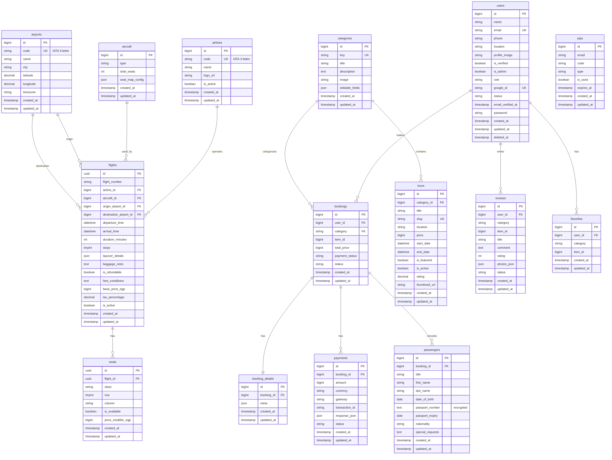
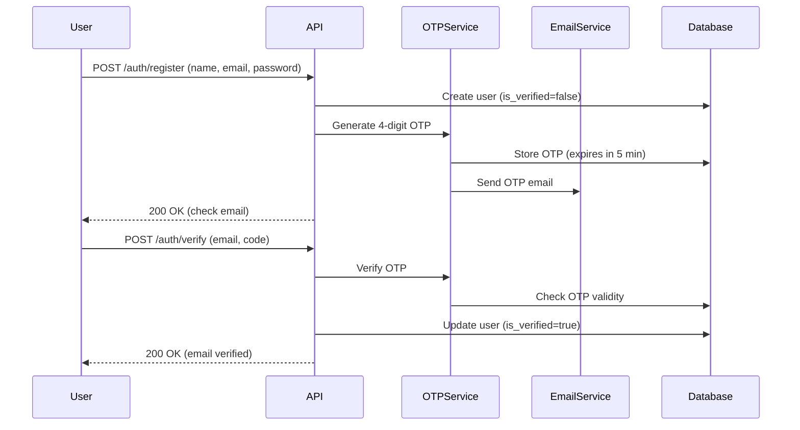
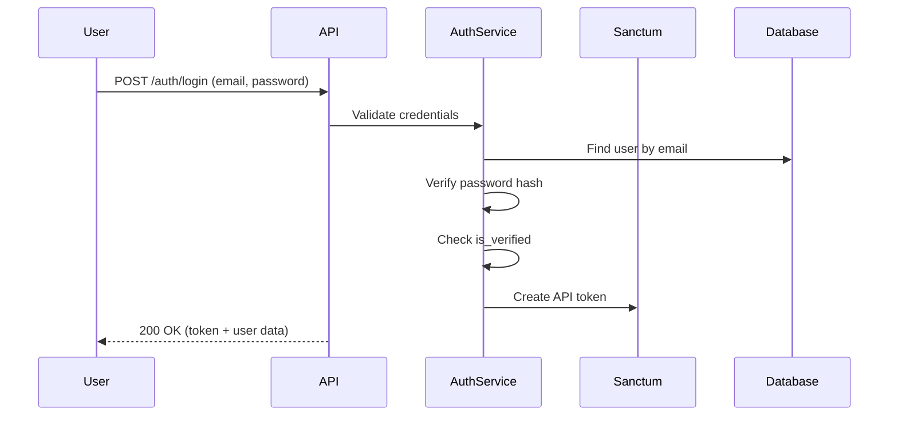

<p align="center">
  
  
  
  
</p>

<h1 align="center">🌍 Safarni - Travel Platform Backend</h1>

<p align="center">
  <strong>A comprehensive travel booking platform API built with Laravel 12</strong>
</p>

<p align="center">
  Safarni (سافرني - "Let me travel" in Arabic) is a modern travel platform backend that provides APIs for booking flights, tours, hotels, and car rentals. The platform serves as the backbone for mobile and web applications, offering secure authentication, real-time seat management, and comprehensive booking workflows.
</p>

---

## 📋 Table of Contents

- [Project Overview](#-project-overview)
- [Technology Stack](#-technology-stack)
- [Architecture](#-architecture)
- [Features Implementation Status](#-features-implementation-status)
- [Database Schema](#-database-schema)
- [ER Diagram](#-er-diagram)
- [API Endpoints](#-api-endpoints)
- [Authentication Flow](#-authentication-flow)
- [Project Structure](#-project-structure)
- [Environment Setup](#-environment-setup)
- [Testing](#-testing)
- [Future Roadmap](#-future-roadmap)

---

## 🎯 Project Overview

Safarni is a full-featured travel booking platform designed to handle:

1. **Flight Booking System** - Search, compare, and book flights with seat selection
2. **Tour Packages** - Browse and book guided tour packages
3. **Hotels** *(Planned)* - Hotel room reservations
4. **Car Rentals** *(Planned)* - Vehicle rental services

### Business Model

The platform operates with a **multi-category booking system** where:
- Each booking type (flights, tours, hotels, cars) shares a unified booking infrastructure
- Payments are processed through a centralized payment system
- User reviews and favorites work across all categories

### Target Users

| User Type | Description |
|-----------|-------------|
| **Guest** | Browse flights, tours without authentication |
| **User** | Full booking capabilities, profile management |
| **Admin** | System management, CRUD operations on entities |

---

## 🛠 Technology Stack

| Component | Technology |
|-----------|------------|
| **Framework** | Laravel 12 |
| **PHP Version** | 8.2+ |
| **Authentication** | Laravel Sanctum |
| **Database** | MySQL / SQLite |
| **Email Service** | Brevo (Sendinblue) |
| **Testing** | PHPUnit 11 |
| **Code Style** | Laravel Pint |
| **API Format** | RESTful JSON |

### Key Dependencies

```json
{
  "laravel/framework": "^12.0",
  "laravel/sanctum": "^4.0",
  "symfony/brevo-mailer": "7.2"
}
```

---

## 🏗 Architecture

The project follows a **Service-Repository Pattern** with clear separation of concerns:

```
┌─────────────────────────────────────────────────────────────────┐
│                        HTTP Request                              │
└─────────────────────────────────────────────────────────────────┘
                              │
                              ▼
┌─────────────────────────────────────────────────────────────────┐
│                      API Controllers                             │
│  (AuthController, FlightController, BookingController, etc.)     │
└─────────────────────────────────────────────────────────────────┘
                              │
                              ▼
┌─────────────────────────────────────────────────────────────────┐
│                        Services                                  │
│  (AuthService, FlightService, BookingService, SeatService, etc.) │
└─────────────────────────────────────────────────────────────────┘
                              │
                              ▼
┌─────────────────────────────────────────────────────────────────┐
│                      Repositories                                │
│  (UserRepository, FlightRepository, BookingRepository, etc.)     │
└─────────────────────────────────────────────────────────────────┘
                              │
                              ▼
┌─────────────────────────────────────────────────────────────────┐
│                    Eloquent Models                               │
│    (User, Flight, Booking, Seat, Passenger, Payment, etc.)       │
└─────────────────────────────────────────────────────────────────┘
                              │
                              ▼
┌─────────────────────────────────────────────────────────────────┐
│                        Database                                  │
└─────────────────────────────────────────────────────────────────┘
```

### Design Patterns Used

- **Repository Pattern**: Abstracts data layer from business logic
- **Service Pattern**: Encapsulates business logic
- **Factory Pattern**: Test data generation
- **Enum Pattern**: Type-safe status and role management

---

## ✅ Features Implementation Status

### Core Features

| Feature | Status | Description |
|---------|--------|-------------|
| User Registration | ✅ Complete | Email-based registration with OTP verification |
| Email Verification | ✅ Complete | 4-digit OTP sent via Brevo email service |
| Login | ✅ Complete | Email/password authentication with Sanctum tokens |
| Google OAuth | ✅ Complete | Social login integration |
| Password Reset | ✅ Complete | OTP-based password recovery flow |
| Profile Management | ✅ Complete | View, update, deactivate, delete account |

### Flight Booking Module

| Feature | Status | Description |
|---------|--------|-------------|
| Flight Search | ✅ Complete | Search by origin, destination, date |
| Flight Filtering | ✅ Complete | Filter by stops, price range |
| Flight Comparison | ✅ Complete | Compare multiple flights side-by-side |
| Seat Inventory | ✅ Complete | View available seats with class types |
| Seat Locking | ✅ Complete | Temporary seat reservation during checkout |
| Seat Release | ✅ Complete | Auto/manual release of locked seats |
| Passenger Management | ✅ Complete | Add/edit passenger details for booking |
| Booking Summary | ✅ Complete | Price calculation with taxes |
| Booking Checkout | ✅ Complete | Complete booking workflow |
| Booking Cancellation | ✅ Complete | Cancel bookings with status updates |

### Admin Features

| Feature | Status | Description |
|---------|--------|-------------|
| Airport CRUD | ✅ Complete | Create, read, update, delete airports |
| Airline CRUD | ✅ Complete | Manage airline information |
| Flight CRUD | ✅ Complete | Full flight management |

### Modules In Progress / Planned

| Feature | Status | Description |
|---------|--------|-------------|
| Tour Booking | 🚧 In Progress | Tour package browsing and booking |
| Hotel Booking | 📋 Planned | Hotel room reservations |
| Car Rentals | 📋 Planned | Vehicle rental services |
| Payment Gateway | 📋 Planned | Stripe/Payment integration |
| Notifications | 📋 Planned | Push/Email notifications |

---

## 💾 Database Schema

### Tables Overview

| Table | Description | Key Fields |
|-------|-------------|------------|
| `users` | User accounts | id, name, email, password, role, is_verified |
| `categories` | Booking categories | id, key, title, description |
| `bookings` | All booking records | id, user_id, category, item_id, total_price, status |
| `booking_details` | Extended booking data | id, booking_id, meta (JSON) |
| `payments` | Payment transactions | id, booking_id, amount, gateway, status |
| `airports` | Airport locations | id, code (IATA), name, city, coordinates |
| `airlines` | Airline carriers | id, code (IATA), name, logo_url |
| `aircraft` | Plane configurations | id, type, total_seats, seat_map_config |
| `flights` | Flight schedules | id (UUID), flight_number, airline_id, departure_time |
| `seats` | Seat inventory | id (UUID), flight_id, class, row, column, is_available |
| `passengers` | Traveler details | id, booking_id, first_name, passport_number |
| `tours` | Tour packages | id, category_id, title, location, price |
| `otps` | Verification codes | id, email, code, type, expires_at |
| `reviews` | User reviews | id, user_id, category, item_id, rating |
| `favorites` | User favorites | id, user_id, category, item_id |

---

## 📊 ER Diagram



---

## 🔌 API Endpoints

### Public Endpoints (No Authentication)

#### Health Check & Home
| Method | Endpoint | Description |
|--------|----------|-------------|
| GET | `/api/health` | API health status |
| GET | `/api/home` | Homepage data (featured tours, categories) |

#### Authentication
| Method | Endpoint | Description |
|--------|----------|-------------|
| POST | `/api/auth/register` | Register new user |
| POST | `/api/auth/verify` | Verify email with OTP |
| POST | `/api/auth/login` | User login |
| GET | `/api/auth/google` | Google OAuth redirect |
| GET | `/api/auth/google/callback` | Google OAuth callback |
| POST | `/api/auth/forgot-password` | Initiate password reset |
| POST | `/api/auth/verify-reset-otp` | Verify reset OTP |
| POST | `/api/auth/reset-password` | Complete password reset |
| POST | `/api/auth/resend-otp` | Resend verification OTP |

#### Airports
| Method | Endpoint | Description |
|--------|----------|-------------|
| GET | `/api/airports` | List all airports |
| GET | `/api/airports/{id}` | Get airport details |
| GET | `/api/airports/code/{code}` | Find airport by IATA code |

#### Airlines
| Method | Endpoint | Description |
|--------|----------|-------------|
| GET | `/api/airlines` | List all airlines |
| GET | `/api/airlines/{id}` | Get airline details |
| GET | `/api/airlines/code/{code}` | Find airline by IATA code |

#### Flights
| Method | Endpoint | Description |
|--------|----------|-------------|
| GET | `/api/flights` | Search flights with filters |
| GET | `/api/flights/{id}` | Get flight details |
| GET | `/api/flights/compare` | Compare multiple flights |
| GET | `/api/flights/{id}/seats` | Get available seats |

### Protected Endpoints (Requires Authentication)

#### Profile Management
| Method | Endpoint | Description |
|--------|----------|-------------|
| GET | `/api/profile` | Get user profile |
| PUT | `/api/profile` | Update profile |
| PUT | `/api/profile/password` | Change password |
| POST | `/api/profile/deactivate` | Deactivate account |
| DELETE | `/api/profile` | Delete account |

#### Seat Management
| Method | Endpoint | Description |
|--------|----------|-------------|
| POST | `/api/seats/lock` | Lock seats temporarily |
| DELETE | `/api/seats/{id}/release` | Release locked seat |

#### Bookings
| Method | Endpoint | Description |
|--------|----------|-------------|
| GET | `/api/bookings` | List user's bookings |
| POST | `/api/bookings/summary` | Get booking price summary |
| POST | `/api/bookings/checkout` | Complete booking |
| GET | `/api/bookings/{id}` | Get booking details |
| POST | `/api/bookings/{id}/cancel` | Cancel booking |

#### Passengers
| Method | Endpoint | Description |
|--------|----------|-------------|
| GET | `/api/bookings/{id}/passengers` | List passengers |
| POST | `/api/bookings/{id}/passengers` | Add passenger |
| GET | `/api/passengers/{id}` | Get passenger details |
| PUT | `/api/passengers/{id}` | Update passenger |
| DELETE | `/api/passengers/{id}` | Remove passenger |

### Admin Endpoints (Requires Admin Role)

| Method | Endpoint | Description |
|--------|----------|-------------|
| POST | `/api/admin/airports` | Create airport |
| PUT | `/api/admin/airports/{id}` | Update airport |
| DELETE | `/api/admin/airports/{id}` | Delete airport |
| POST | `/api/admin/airlines` | Create airline |
| PUT | `/api/admin/airlines/{id}` | Update airline |
| DELETE | `/api/admin/airlines/{id}` | Delete airline |
| POST | `/api/admin/flights` | Create flight |
| PUT | `/api/admin/flights/{id}` | Update flight |
| DELETE | `/api/admin/flights/{id}` | Delete flight |

---

## 🔐 Authentication Flow

### Registration & Verification Flow



### Login Flow



---

## 📁 Project Structure

```
huma-volve-backend/
├── app/
│   ├── Enums/                    # PHP Enums for type safety
│   │   ├── BookingStatus.php     # pending, confirmed, cancelled, completed
│   │   ├── FlightStatus.php      # scheduled, delayed, cancelled, etc.
│   │   ├── OtpType.php           # verification, password_reset
│   │   ├── PassengerTitle.php    # Mr, Mrs, Ms, Dr
│   │   ├── PaymentStatus.php     # pending, completed, failed, refunded
│   │   ├── SeatClass.php         # economy, business, first
│   │   └── UserRole.php          # user, admin, guest
│   │
│   ├── Http/
│   │   └── Controllers/
│   │       └── Api/              # API Controllers
│   │           ├── AirlineController.php
│   │           ├── AirportController.php
│   │           ├── AuthController.php
│   │           ├── BookingController.php
│   │           ├── FlightController.php
│   │           ├── HomeController.php
│   │           ├── PassengerController.php
│   │           ├── ProfileController.php
│   │           └── SeatController.php
│   │
│   ├── Interfaces/               # Repository interfaces
│   │
│   ├── Models/                   # Eloquent models
│   │   ├── Aircraft.php
│   │   ├── Airline.php
│   │   ├── Airport.php
│   │   ├── Booking.php
│   │   ├── BookingDetail.php
│   │   ├── Category.php
│   │   ├── Favorite.php
│   │   ├── Flight.php
│   │   ├── Otp.php
│   │   ├── Passenger.php
│   │   ├── Payment.php
│   │   ├── Review.php
│   │   ├── Seat.php
│   │   ├── Tour.php
│   │   └── User.php
│   │
│   ├── Repositories/             # Data access layer
│   │
│   └── Services/                 # Business logic layer
│       ├── AirlineService.php
│       ├── AirportService.php
│       ├── AuthService.php
│       ├── BookingService.php
│       ├── FlightService.php
│       ├── HomeService.php
│       ├── OtpService.php
│       ├── PassengerService.php
│       ├── ProfileService.php
│       └── SeatService.php
│
├── database/
│   ├── factories/                # Model factories for testing
│   ├── migrations/               # Database schema
│   └── seeders/                  # Sample data seeders
│
├── routes/
│   └── api.php                   # API route definitions
│
├── tests/
│   └── Feature/
│       └── Api/                  # API feature tests
│           ├── AirlineApiTest.php
│           ├── AirportApiTest.php
│           ├── AuthApiTest.php
│           ├── BookingApiTest.php
│           ├── FlightApiTest.php
│           ├── HomeApiTest.php
│           └── SeatApiTest.php
│
└── config/
    └── otp.php                   # OTP configuration
```

---

## ⚙️ Environment Setup

### Prerequisites

- PHP 8.2 or higher
- Composer
- MySQL 8.0+ or SQLite
- Node.js & NPM (for frontend assets)

### Environment Variables

```env
# Application
APP_NAME=Safarni
APP_ENV=local
APP_DEBUG=true
APP_URL=http://localhost:8000

# Database
DB_CONNECTION=mysql
DB_HOST=127.0.0.1
DB_PORT=3306
DB_DATABASE=safarni
DB_USERNAME=root
DB_PASSWORD=

# Sanctum
SANCTUM_STATEFUL_DOMAINS=localhost:3000

# Mail (Brevo)
MAIL_MAILER=brevo
MAIL_FROM_ADDRESS=noreply@safarni.com
MAIL_FROM_NAME="${APP_NAME}"
BREVO_API_KEY=your-brevo-api-key

# Google OAuth
GOOGLE_CLIENT_ID=your-google-client-id
GOOGLE_CLIENT_SECRET=your-google-client-secret
GOOGLE_REDIRECT_URI=${APP_URL}/api/auth/google/callback

# OTP Settings (see config/otp.php)
OTP_LENGTH=4
OTP_EXPIRY_MINUTES=5
```

### Installation Commands

```bash
# Clone repository
git clone <repository-url>
cd huma-volve-backend

# Install dependencies
composer install

# Environment setup
cp .env.example .env
php artisan key:generate

# Database setup
php artisan migrate
php artisan db:seed

# Start development server
php artisan serve
```

---

## 🧪 Testing

### Test Coverage

The project includes comprehensive feature tests for all API endpoints:

| Test Suite | Test Cases | Description |
|------------|------------|-------------|
| `AuthApiTest` | 15+ tests | Registration, login, OTP, password reset |
| `AirportApiTest` | 10+ tests | CRUD operations, search functionality |
| `AirlineApiTest` | 10+ tests | CRUD operations, code lookup |
| `FlightApiTest` | 12+ tests | Search, filtering, comparison |
| `SeatApiTest` | 8+ tests | Availability, locking, release |
| `BookingApiTest` | 10+ tests | Summary, checkout, cancellation |
| `HomeApiTest` | 5+ tests | Homepage data, categories |

### Running Tests

```bash
# Run all tests
php artisan test

# Run specific test file
php artisan test --filter=AuthApiTest

# Run with coverage report
php artisan test --coverage
```

---

## 🗺 Future Roadmap

### Phase 1: Complete Core Modules *(In Progress)*
- [ ] Tour booking flow completion
- [ ] Review and rating system
- [ ] Favorites functionality

### Phase 2: Payment Integration
- [ ] Stripe payment gateway
- [ ] Payment webhooks
- [ ] Refund processing

### Phase 3: Extended Features
- [ ] Hotel booking module
- [ ] Car rental module
- [ ] Multi-language support (Arabic/English)
- [ ] Push notifications

### Phase 4: Advanced Features
- [ ] Real-time flight tracking
- [ ] Price alerts
- [ ] Loyalty program
- [ ] Admin dashboard (web interface)

---

## 📄 License

This project is proprietary software developed for Huma-volve.

---

<p align="center">
  <strong>Built with ❤️ by Huma-volve Team</strong>
</p>
