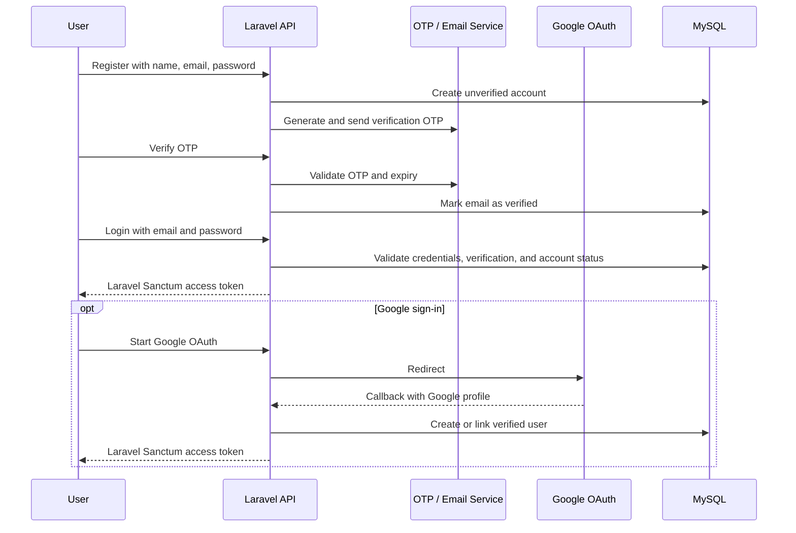
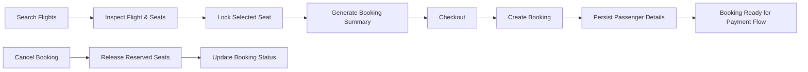
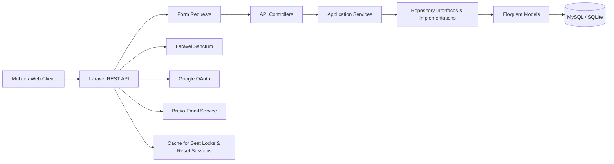

<h1 align="center">Safarni</h1>

<p align="center">
  <strong>Travel Booking Platform Backend</strong>
</p>

<p align="center">
  A Laravel REST API for secure traveler accounts, flight discovery, seat locking, booking workflows, hotel browsing, and travel-platform administration.
</p>

<p align="center">
  
  
  
  
  
  
</p>

<p align="center">
  <a href="#features">Features</a> •
  <a href="#authentication-flow">Authentication Flow</a> •
  <a href="#booking-workflow">Booking Workflow</a> •
  <a href="#architecture">Architecture</a> •
  <a href="#api-highlights">API Highlights</a> •
  <a href="#quick-start">Quick Start</a>
</p>

---

## Overview

Safarni is a team backend project built during a backend training program. It provides the API layer for a travel platform covering traveler onboarding, flight search, seat availability, booking checkout, profile management, hotel discovery, and administrative flight operations.

This repository is intentionally presented as a **backend/API project**. Its value is in the authentication and travel-booking workflows, validation, role boundaries, service-repository architecture, and automated tests—not in a frontend user interface.

---

## Features

### Authentication & Account Security

- Email/password registration with email-verification OTP.
- OTP resend protection through rate limiting.
- Email/password login with Laravel Sanctum personal-access tokens.
- Google OAuth redirect and callback flow.
- Password-reset flow: request reset OTP → verify OTP → receive short-lived reset session → set a new password.
- Protected profile update, password change, account deactivation, soft deletion, and token revocation workflows.
- Role-based access control for administrative endpoints.

### Flight Discovery & Booking

- Flight search, filtering, comparison, flight details, and seat availability APIs.
- Temporary seat locking and manual seat release for authenticated users.
- Booking summary endpoint before checkout.
- Checkout workflow for creating a booking and its related traveler/passenger records.
- Booking listing, viewing, cancellation, and passenger management endpoints.
- Server-side money handling with integer Egyptian piasters to avoid floating-point precision issues.

### Hotel, Tour & Platform Operations

- Hotel recommendations, nearby discovery, search, room availability, reviews, and gallery endpoints.
- Tour availability, recommendations, destinations, and detail endpoints.
- Administrative CRUD operations for airports, airlines, and flights.
- Protected, role-based management routes using `auth:sanctum` and `role:admin`.

---

## Authentication Flow



### Password Reset Flow

```mermaid
sequenceDiagram
    participant User
    participant API as Laravel API
    participant OTP as OTP / Email Service
    participant Cache

    User->>API: Request password reset
    API->>OTP: Send password-reset OTP
    User->>API: Verify reset OTP
    API->>Cache: Store short-lived reset token
    API-->>User: Reset session token
    User->>API: Submit new password + reset token
    API->>Cache: Validate and clear reset token
    API-->>User: Password updated; existing tokens revoked
```

---

## Booking Workflow



### Booking Controls

| Control | Purpose |
| --- | --- |
| Temporary seat locks | Prevents conflicting seat selection while a user proceeds through checkout. |
| Authenticated checkout | Restricts booking actions to verified platform users. |
| Booking summary | Calculates the checkout context before a booking is created. |
| Passenger records | Keeps traveler details associated with the booking. |
| Cancellation flow | Releases seats and updates booking state. |
| Integer money values | Stores prices in Egyptian piasters for precise calculations. |

---

## Architecture



### Design Approach

| Area | Implementation |
| --- | --- |
| **API layer** | RESTful JSON routes, resource responses, request validation, and consistent API response handling. |
| **Business logic** | Service classes manage authentication, flight, booking, seat, and supporting platform flows. |
| **Data access** | Repository interfaces and implementations separate persistence concerns from services. |
| **Authentication** | Laravel Sanctum tokens with verification and account-status checks. |
| **Authorization** | Middleware for verified-user and role-based actions. |
| **Testing** | PHPUnit with SQLite configured for test execution. |

---

## Tech Stack

| Area | Technologies |
| --- | --- |
| **Backend** | PHP 8.2+, Laravel 12, Eloquent ORM, REST APIs, API Resources, Form Requests, PHP Enums |
| **Authentication** | Laravel Sanctum, email OTP, Google OAuth, token revocation |
| **Data** | MySQL, SQLite for tests, Laravel migrations and seeders |
| **Email & HTTP** | Brevo mailer, Symfony HTTP Client |
| **Architecture** | Service-Repository Pattern, dependency injection, role middleware, API response traits |
| **Quality** | PHPUnit, Laravel Pint, Faker, Mockery |

---

## API Highlights

### Public Authentication

| Method | Endpoint | Purpose |
| --- | --- | --- |
| `POST` | `/auth/register` | Create an account and trigger email verification. |
| `POST` | `/auth/verify` | Verify the registration OTP. |
| `POST` | `/auth/resend-otp` | Resend an OTP with rate limiting. |
| `POST` | `/auth/login` | Authenticate and receive a Sanctum token. |
| `GET` | `/auth/google` | Start Google OAuth. |
| `GET` | `/auth/google/callback` | Handle Google OAuth callback. |
| `POST` | `/auth/forgot-password` | Request a password-reset OTP. |
| `POST` | `/auth/verify-reset-otp` | Verify reset OTP and receive a reset session. |
| `POST` | `/auth/reset-password` | Reset the password using the reset session. |

### Protected Travel APIs

| Area | Example Endpoints |
| --- | --- |
| **Profile** | `GET /profile`, `PUT /profile`, `PUT /profile/password` |
| **Flights** | `GET /flights`, `GET /flights/compare`, `GET /flights/{flight}/seats` |
| **Seats** | `POST /seats/lock`, `DELETE /seats/{seat}/release` |
| **Bookings** | `GET /bookings`, `POST /bookings/summary`, `POST /bookings/checkout`, `POST /bookings/{booking}/cancel` |
| **Passengers** | `GET /bookings/{booking}/passengers`, `POST /bookings/{booking}/passengers` |
| **Hotels** | `GET /hotels/recommendations`, `GET /hotels/nearby`, `GET /hotels/search` |
| **Administration** | `POST /admin/airports`, `POST /admin/airlines`, `POST /admin/flights` |

---

## Repository Structure

```text
.
├── app/
│   ├── Enums/                 # OTP, roles, booking and status enums
│   ├── Http/
│   │   ├── Controllers/Api/   # REST API controllers
│   │   ├── Middleware/        # Verification and role controls
│   │   ├── Requests/          # Validation rules
│   │   └── Resources/         # API transformations
│   ├── Interfaces/Repositories/
│   ├── Repositories/          # Data-access implementations
│   ├── Services/              # Auth, booking, seat, flight, and domain workflows
│   └── Models/                # Eloquent models and relationships
├── database/
│   ├── migrations/
│   └── seeders/
├── routes/api.php             # Public, protected, and admin API routes
├── tests/                     # Feature and unit tests
├── huma-volve-backend.postman_collection.json
└── README.md
```

---

## Quick Start

### Prerequisites

- PHP 8.2+
- Composer
- MySQL for local development, or SQLite for a lightweight local/test setup

### 1. Clone and Install

```bash
git clone https://github.com/YousefAlTohamy/Safarni.git
cd Safarni
composer install
```

### 2. Configure the Application

```bash
cp .env.example .env
php artisan key:generate
```

Configure a local database and only add development credentials for Brevo and Google OAuth when those integrations are required. Never commit real credentials or user data.

### 3. Prepare the Database

```bash
php artisan migrate --seed
```

### 4. Run the API

```bash
php artisan serve
```

The health endpoint is available at:

```text
GET /api/health
```

---

## Testing

```bash
# Run the complete test suite
php artisan test

# Useful focused checks
php artisan test --filter=Auth
php artisan test --filter=Booking
php artisan test --filter=Seat
```

---

## Project Scope Note

Safarni includes completed authentication, flight-search, seat, booking, passenger, hotel-discovery, tour-discovery, and admin-management APIs. Payment-gateway integration and some booking categories remain planned work, so this repository does not present them as finished production features

---

## Team Project Note

This repository was developed as a **team project during backend training**. It is shared publicly as a technical backend project showcase and learning reference.
